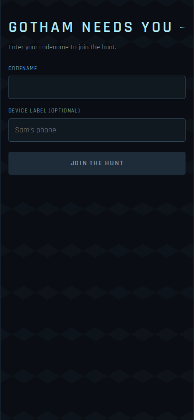
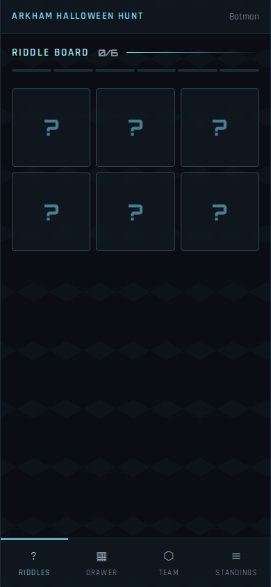
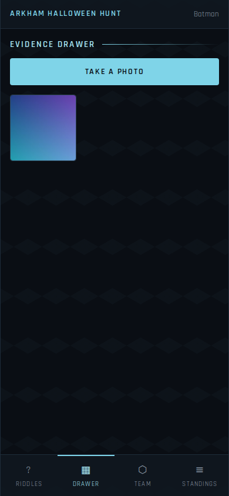
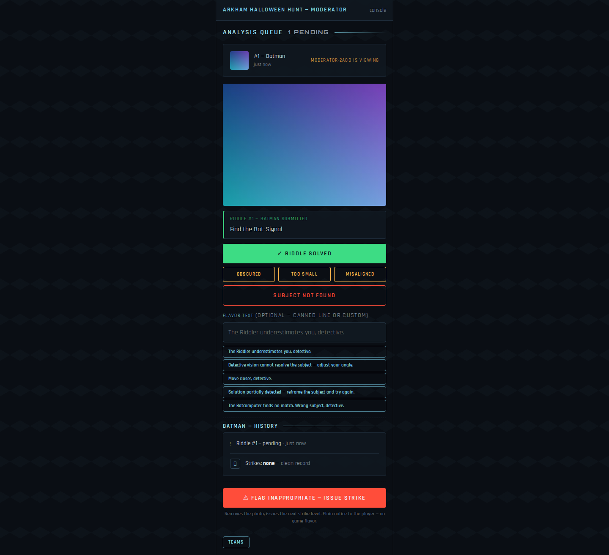
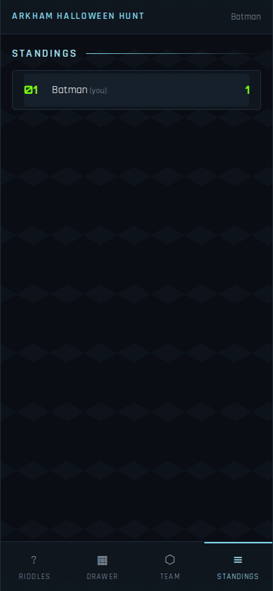

# Arkham Halloween Photo Scavenger Hunt

A themed, asynchronous photo scavenger hunt for parties. Players solve
riddles by photographing subjects around the venue; moderators review
submissions from a queue and issue Arkham-style verdicts — `SUBJECT
VERIFIED`, `SUBJECT OBSCURED`, `SUBJECT NOT FOUND`, `MISALIGNED` — through
a Batcomputer-flavored PWA.

Built as a themeable core: Batman: Arkham Knight/City is the first theme
pack, not a fork point.

## Status

The MVP backend, PWA, moderation flow, team stretch, deployment recipe, and
layered quality checks are implemented. The specification, build plan, and
progress tracker live in [`docs/`](docs/).

- [`docs/design.md`](docs/design.md) — the spec: game loop, verdict
  states, moderation & conduct systems, data model, flow diagrams
- [`docs/build-plan.md`](docs/build-plan.md) — repo layout and runnable
  increments
- [`docs/progress.md`](docs/progress.md) — what's done, what's next
- [`docs/reference/THEME-NOTES.md`](docs/reference/THEME-NOTES.md) —
  Arkham visual language and verdict copy bank

## What it looks like

The player PWA is designed for phones at the venue. Moderators use a separate
queue view on a larger screen. These captures come from the deterministic
Playwright flow described in [`docs/impl/testing.md`](docs/impl/testing.md).

<table>
  <tr>
    <td></td>
    <td></td>
    <td></td>
  </tr>
  <tr>
    <td align="center">Join</td>
    <td align="center">Riddle board</td>
    <td align="center">Evidence drawer</td>
  </tr>
  <tr>
    <td colspan="2"></td>
    <td></td>
  </tr>
  <tr>
    <td colspan="2" align="center">Moderator console</td>
    <td align="center">Standings</td>
  </tr>
</table>

## Quality checks

Install the locked Python and npm dependencies, then run the shared fast gate:

```sh
bash scripts/check-quality.sh
```

The fast gate runs server tests with branch-aware coverage and Ruff, the
isolated backup/restore check, frontend unit tests, and the production build.
The built-PWA browser smoke and the Podman deployment smoke remain explicit
longer gates:

```sh
npm --prefix web run test:e2e -- --workers=1
bash scripts/smoke-container.sh
```

See [`docs/impl/testing.md`](docs/impl/testing.md) for the layer boundaries,
required tools, and failure-artifact locations.

## Planned stack

- **Backend**: Python + FastAPI + SQLite
- **Frontend**: Preact + Vite PWA (installable, camera-first)
- **Access**: QR-scannable join codes for players, admin login for hosts,
  moderator codes for the review queue

## License

[GNU AGPL-3.0](LICENSE). Free to use, self-host, and modify — but if you
run a modified version as a service (even without distributing it), you
must offer your source. This is a hobby project that will not be
productized; the AGPL keeps it free for parties and off-limits to free
commercial rides.
