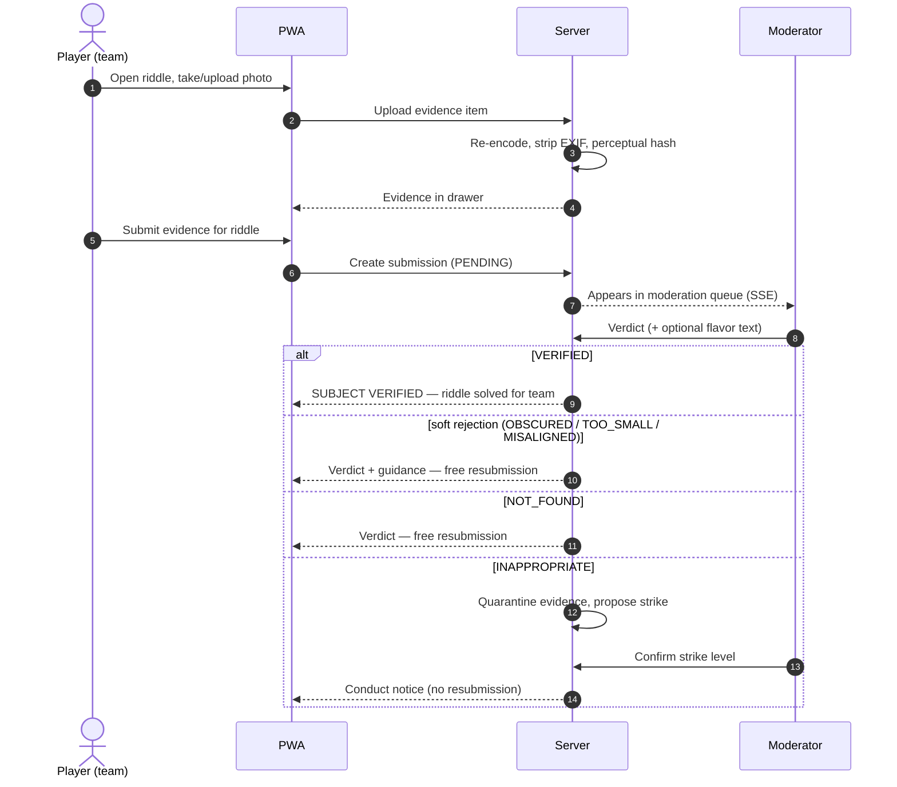
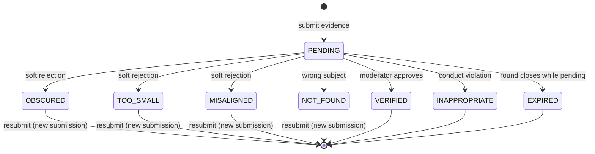
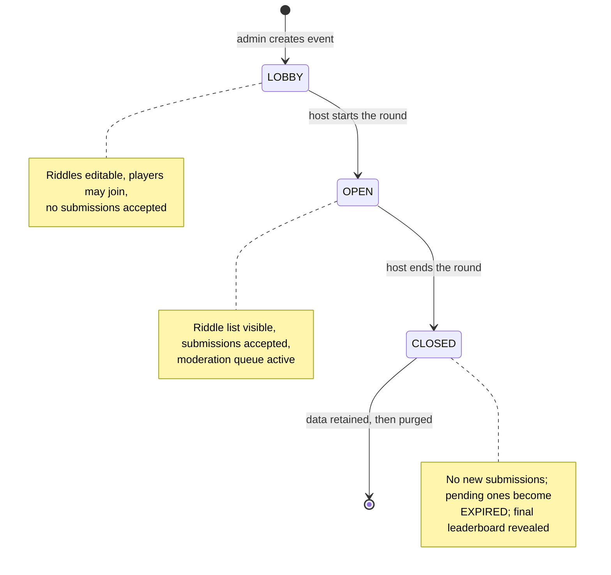
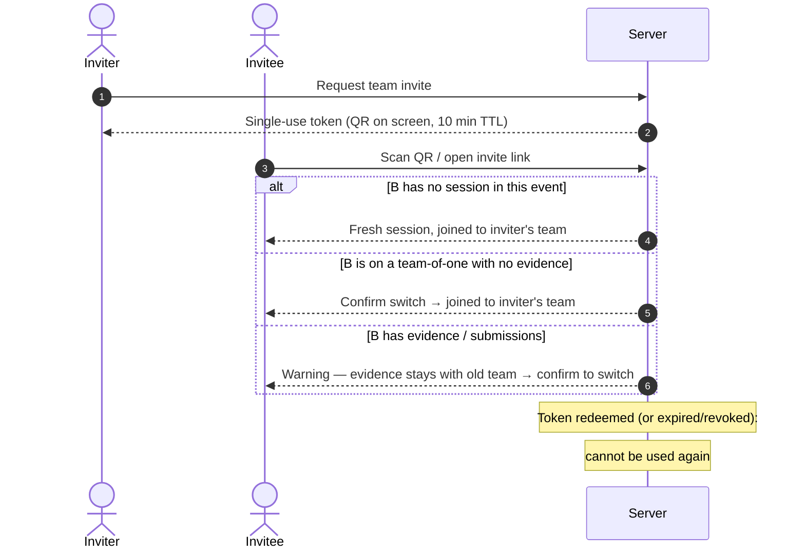
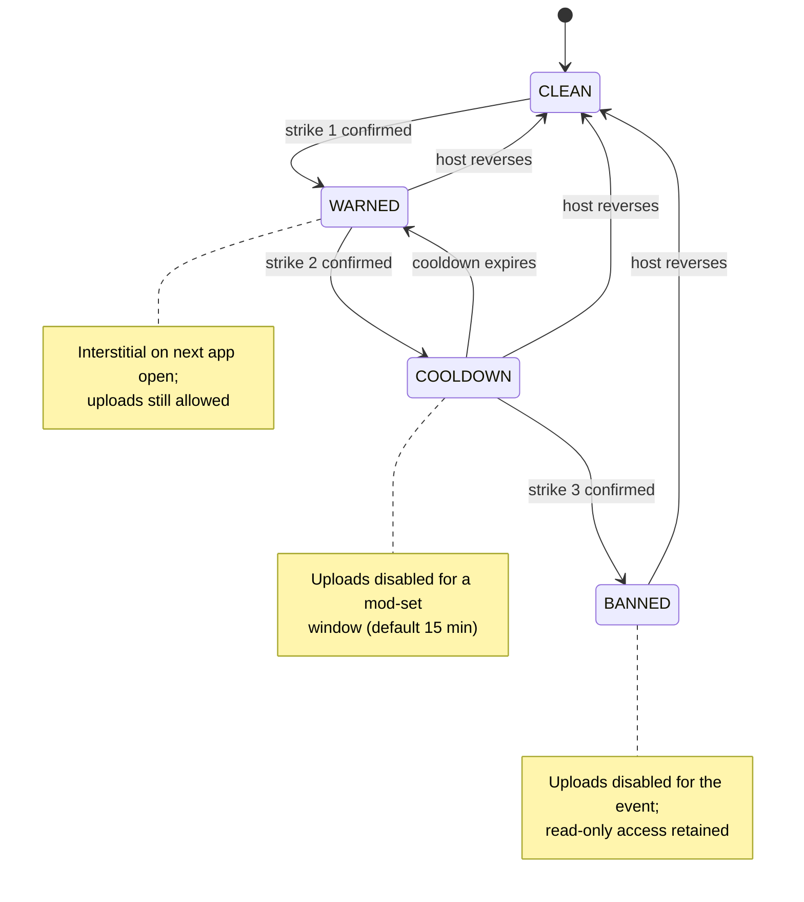

# Design: Themed Photo Scavenger Hunt (working title)

## Event shape

- **Players**: 10–30 friends/acquaintances at a house party.
- **Duration**: one night, one scoring round.
- **Content**: 12–15 riddles pointing at photo subjects around the house and yard.
- **Scoring**: one point per verified riddle. Win conditions: first to solve all, or most solved at end of round. No speed bonuses, no tiers.
- **Anti-cheat**: minimal by design — subjects are on-site, so stock photos don't help. No proof-of-presence tokens, no EXIF checks.

## Experience

Standalone **progressive web app** — installable to home screen, but the only device capability we really need is the camera/photo picker. No accounts with passwords; players join an event with a short code and pick a display name.

First theme: **Batman: Arkham Knight/City**. The software must be theme-agnostic: theme = frontend skin (colors, fonts, copy strings, verdict messages) over a neutral core. Future events get a new theme pack, not a fork.

## Game loop

1. Player opens a riddle, takes/uploads a photo of the subject, submits.
2. Submission enters state `PENDING` (Arkham skin: `SCANNING...`).
3. A moderator reviews from a queue and issues a verdict:
   - `VERIFIED` → point awarded, riddle marked solved for that player.
   - `SUBJECT OBSCURED` → right idea, unusable photo (blocked, blurry, too dark, cropped). Free resubmission.
   - `SUBJECT NOT FOUND` → wrong subject. Free resubmission.
   - `SUBJECT TOO SMALL` → subject too distant or cropped to verify. Free resubmission.
   - `MISALIGNED` → right area, wrong framing or angle. Free resubmission.
4. Player sees verdict + moderator flavor text, resubmits if rejected.

Verdicts are the core flavor surface. The Arkham theme ships canned Batcomputer/Riddler-style lines per verdict type; moderators pick one or write custom text.

### Verdict states (core, theme-neutral)

| Core state   | Arkham skin        | Meaning                              |
| ------------ | ------------------ | ------------------------------------ |
| `PENDING`    | `SCANNING...`      | Awaiting moderator review            |
| `VERIFIED`   | `SUBJECT VERIFIED` | Accepted, point awarded              |
| `OBSCURED`   | `SUBJECT OBSCURED` | Right subject, bad photo (blocked/blurry); resubmit |
| `NOT_FOUND`  | `SUBJECT NOT FOUND`| Wrong subject; resubmit              |
| `TOO_SMALL`  | `SUBJECT TOO SMALL`| Subject too distant/cropped to verify; resubmit |
| `MISALIGNED` | `MISALIGNED`       | Right area, wrong framing/angle; resubmit |
| `INAPPROPRIATE` | `FLAGGED`       | Conduct violation; no resubmit, strike issued |
| `EXPIRED`    | `INTEL EXPIRED`    | Round ended before review (optional) |

`TOO_SMALL` and `MISALIGNED` are taken from the game's actual riddle-scan
feedback. Like `OBSCURED`, they are soft rejections with free resubmission —
they give moderators precise, in-fiction language for the two most common
"try again" cases: the subject is there but unresolvable at that distance,
and the player photographed the right area from the wrong position.

## Moderator experience

- **Queue view**: pending submissions, oldest first (or grouped by riddle).
  Photo, player name, and riddle text side by side.
- **One-tap verdicts** with optional flavor-text picker/override.
- **Per-player history** so moderators stay consistent.
- Moderator role assigned at event setup (host creates event, gets a mod link/code).
- Multiple moderators can work the queue simultaneously. Opening a
  submission **soft-claims** it: the server records `claimed_by` +
  timestamp and the queue shows other moderators that it's being looked
  at, but the claim never blocks — a second moderator can still open it,
  and **first committed verdict wins**. A soft claim avoids the common
  case (two mods deliberating over the same photo) without a locking
  protocol that can deadlock when a moderator's phone sleeps.
- **Verdicts are conditional writes**: the verdict endpoint updates the
  submission only `WHERE status = 'PENDING'`. A verdict that loses the
  race (another moderator's verdict, or round closure expiring the
  submission first) gets an explicit "already resolved" response, never
  a silent overwrite. Verdicts are final once committed — there is no
  un-verify; a mistaken `VERIFIED` is corrected socially, not in data.

### Conduct enforcement: strikes & upload bans

Humans at parties are occasionally... special. The queue gets a one-tap
`INAPPROPRIATE` verdict for content violations, separate from the game
verdicts. It is a conduct action, not a game ruling: no playful Arkham
copy, no resubmission prompt, and the player is told plainly that the
submission was removed for violating the event rules.

- **One tap from the queue**: the `INAPPROPRIATE` button sits beside the
  game verdicts but visually separated (danger styling, confirm step
  optional). It issues the verdict *and* a strike in one action — a
  moderator under queue load should never need a second screen for this.
  The riddle itself stays open for the team: the flagged photo is dead,
  but a *new* photo for the same riddle may be submitted normally.
- **Strike state is derived, never stored**: a player's restriction is a
  pure function of their non-reversed strikes — 1 → WARNED, 2 → COOLDOWN
  (until the strike's `cooldown_until`), 3 → BANNED. There is no
  restriction column to go stale, and reversal just flips `reversed_by`/
  `reversed_at` on the strike row; the derived state follows for free.
  Every question like "what if strike 3 lands during a cooldown" has the
  same answer: count the non-reversed strikes.
- **Strike ladder** (per player, per event, shown to moderators on the
  player's history):
  1. **Strike 1 — warning**: interstitial on the player's next app open:
     the photo was removed, repeat violations restrict participation.
  2. **Strike 2 — cooldown**: uploads disabled for a moderator-set
     window (default 15 min). Riddles and leaderboard still visible.
  3. **Strike 3 — upload ban**: submissions disabled for the rest of the
     event. The player keeps read-only access (riddles, leaderboard) —
     full account deletion is the host's manual call, not the ladder's.
- **Moderator-driven, never automatic**: the ladder proposes the next
  step but a moderator confirms it. Party-scale social judgment beats
  automation here.
- **Reversible**: the host/admin can reduce or clear strikes (mis-tap,
  disputed call). Reversals are recorded on the player's history.
- **Content handling**: the flagged evidence item is quarantined —
  removed from the team's drawer and the player-facing app immediately,
  retained in a moderator-only view until the event ends (evidence if
  there's a dispute), then purged with the event data.
- **Notifications**: the affected player sees the strike state and its
  consequence; teammates see only that the photo is gone (the drawer
  doesn't announce *why* — conduct matters stay between player, mods,
  and host).

### Data model deltas (conduct)

- `Strike` (id, player_id, event_id, level, submission_id, issued_by,
  note, cooldown_until, created_at, reversed_by, reversed_at) —
  `cooldown_until` is set only for level 2
- `Player` / `Team`: upload restriction **derived** from non-reversed
  strikes — never a stored flag. 1 strike → warning interstitial,
  2 → uploads blocked until `cooldown_until`, 3 → uploads blocked for
  the event.
- `EvidenceItem`: `quarantined` flag + quarantine metadata

## Flows & state machines

### The core loop (sequence)

### Submission state machine

A resubmission is always a **new** `PENDING` submission referencing the
same riddle — terminal states never reopen. One active (`PENDING`)
submission per riddle per team.

### Event lifecycle

Round closure is a single transaction: flip the event to `CLOSED`, then
mark every still-`PENDING` submission `EXPIRED`. A verdict racing the
closure loses cleanly, because verdicts are conditional writes
(`WHERE status = 'PENDING'` — see Moderator experience): the moderator
gets "already resolved", the submission stays `EXPIRED`, and no point
can appear after the final standings.

### Team invite flow (stretch)

### Strike ladder (conduct)

Strikes never expire on their own within an event (except cooldown
timers), and every transition in either direction is recorded on the
player's history for moderators. Because restriction state is *derived*
from non-reversed strikes, the diagram above is a visualization of that
function, not a stored state: `COOLDOWN → WARNED` happens automatically
when `cooldown_until` passes, and any reversal simply recomputes the
player's position from their strike rows. The strike interstitial is not
a one-shot page: it is part of the player's state snapshot (see
"Realtime" under Architecture), so it appears on the next poll, app
open, or SSE reconnect — whichever comes first.

## Architecture

- **Backend**: Python + **FastAPI**, SQLite store (one file, trivially
  self-hosted; plenty for 30 concurrent users). Owns events, riddles,
  players, submissions, verdicts, and serves uploaded photos.
- **Frontend**: **Preact** PWA (Vite build, service worker, manifest,
  offline-tolerant shell). Preact is enough: a handful of screens, one
  camera input, polling/SSE updates. Camera capture via
  `<input type="file" accept="image/*" capture>`.
- **Realtime**: Server-Sent Events for player verdict notifications and
  moderator queue updates. One-night event, ~30 users — SSE from FastAPI
  handles this without extra infrastructure. SSE carries **deltas only**;
  the source of truth for a client that just loaded or reconnected is a
  single `GET /api/state` snapshot (event status, my team's riddle/submission
  states, my strike status, leaderboard if visible). Phones sleep
  constantly at a party, so every SSE reconnect and every cold start
  re-fetches the snapshot first, then applies deltas. This one rule —
  *snapshot on connect, deltas over the wire* — is what keeps the UI
  correct without any client-side reconciliation logic.
- **Upload pipeline**: photo validation/re-encode/perceptual-hash is
  blocking CPU work, so it runs **off the event loop** (a worker thread
  via `anyio.to_thread` / `run_in_threadpool`), never inside the async
  handler. Re-encoding applies EXIF orientation *before* stripping EXIF
  (`ImageOps.exif_transpose`), or a third of the party's photos come out
  sideways.
- **Theming**: theme pack = config (name, verdict copy, flavor lines) + CSS
  variables/assets. Core UI reads copy from the active theme.

## Hosting & access

- Small public VPS, single deployment.
- **Creator/admin role**: authenticated login (real credentials), can create
  events, manage riddles, and act as moderator.
- **Player access**: no accounts. Each event gets a **join code**: random,
  effectively unguessable, short enough that a full join URL fits
  comfortably in a QR code that phones scan to open the PWA.
  - Sizing: 8–10 characters from an unambiguous alphabet (no `0/O`, `1/I/L`)
    gives ~40–50 bits — unguessable at party scale, and a join URL like
    `https://host.example/j/8XK3Q2MN7P` is trivial QR content. A QR code at
    moderate error correction holds ~100+ alphanumeric chars comfortably, so
    we have ample headroom.
  - The join code *is* the player's credential: opening the link establishes
    a session (cookie/token) tied to that event. Moderator access uses a
    separate moderator code/link, generated alongside the join code.

## Trust & abuse baseline

Party scale means social enforcement does most of the work, but the
following cheap measures close the obvious holes. Ordered roughly by
value-per-effort.

### Multi-teaming (one device, two teams)

A player can trivially hold two sessions on one device (installed PWA +
mobile browser use separate storage). Do **not** try to hard-prevent this:
device fingerprinting is fragile (ITP, private modes) and the whole party
shares one NAT public IP, so network signals are useless. Instead:

- **Visibility**: moderators see all sessions with device label, UA string,
  and last-seen time; the UI flags heuristic matches (same UA, interleaved
  activity across teams).
- **Remove the payoff**: the goal of multi-teaming is submitting the same
  photo for two teams. See duplicate-evidence detection below — that is
  the enforcement, not device detection.

### Duplicate-evidence detection

- Compute a **perceptual hash** (e.g. average/hash via Pillow) on every
  upload.
- Identical or near-identical evidence items across different teams raise
  a flag in the moderator queue ("possible shared evidence"). Moderator
  decides; no automatic punishment.
- Also catches re-uploads of a previously rejected photo with a filter
  slapped on.

### Photo access & download resistance

True download prevention is impossible (screenshots, devtools), so the
goal is access control + reuse detection, not DRM:

- Photos are served **only** through session-authenticated endpoints:
  owning team + moderators. No public or guessable photo URLs.
- Players are served **re-encoded, stripped derivatives** (EXIF/GPS
  removed, resolution capped). Originals are never served to players.
  This doubles as upload hygiene and privacy.
- Screenshot reuse is accepted as unstoppable; the perceptual hash flags
  it if it comes back as another team's submission.

### General hardening checklist (MVP scope)

- **Rate limits**: join-code attempts (brute force), invite redemption,
  upload count/size per team (disk exhaustion).
- **Upload validation**: magic-byte check + server-side re-encode via
  Pillow (never trust content-type), dimension/size caps, EXIF strip.
- **Sessions**: httpOnly + Secure + SameSite cookies; session tokens
  stored hashed at rest; revocation first-class (already in schema).
- **XSS**: display names and moderator flavor text render to other
  players — rely on framework auto-escaping, never raw-HTML injection.
- **CSRF**: SameSite cookies plus a mutation token for state-changing
  endpoints.
- **Admin auth**: real password hashing (argon2id); moderator code is
  separate from the player join code and equally unguessable.
- **Authorization**: every moderator/admin endpoint checks role
  server-side; the client role is cosmetic.
- **Operational durability**: the worst realistic "incident" is losing the
  SQLite file or photos mid-party. One-command backup (DB + photos dir)
  before the event; consider a periodic snapshot during the night.

## Game parameters (decided)

- **Riddles are standalone**: players see the full riddle list when the
  round opens and may submit in any order. No unlock chains, no
  dependencies, no per-riddle hints.
- **Leaderboard visibility**: intentionally left open as a build option —
  implement as an event-level toggle (`live` / `final-reveal`) rather than
  deciding now.

### Data model (MVP)

Team-scoped from day one: the MVP is a "team of one" with no grouping
functionality. Every player gets a team on join; submissions, evidence,
and scoring reference teams. This makes the teams stretch goal purely
additive (invites, roster UI, multi-member drawers) with no migration.

- `Event` (id, join_code, mod_code, theme, status: lobby/open/closed,
  leaderboard_visibility: live/final-reveal)
- `Riddle` (id, event_id, text, sort order)
- `Team` (id, event_id, size_limit) — MVP creates one per player, unnamed
- `Player` (id, team_id, display_name)
- `Session` (token, player_id, device_label, created_at, last_seen_at,
  revoked_at) — first-class from the start so moderation can revoke devices
- `EvidenceItem` (id, team_id, uploaded_by, riddle_id optional tag,
  photo_path, phash, quarantined, created_at) — MVP uploads go straight
  here; "submit" picks from the drawer even for a team of one. `phash`
  is the perceptual hash from the upload pipeline (trust & abuse
  section); `quarantined` hides the item from the drawer and the app
  (conduct section), and is a no-op flag until the conduct increment
  lands.
- `Submission` (id, riddle_id, team_id, submitted_by player_id,
  evidence_item_id, status, created_at)
- `Verdict` (id, submission_id, moderator, verdict, flavor_text, created_at)

Schema invariants enforced by SQLite itself, not by application code:

- **One active submission per riddle per team** — a partial unique index:
  `CREATE UNIQUE INDEX ... ON Submission(riddle_id, team_id) WHERE status = 'PENDING'`.
  Two devices submitting the same riddle at once (or a double-tap) then
  lose deterministically at the database: the loser gets a constraint
  error the API turns into a friendly 409, instead of two `PENDING`
  rows the UI has to untangle. Invariants live as close to the data as
  the database allows.
- **`Session.last_seen_at` throttled** — updated at most once per minute
  per session, not per request; with WAL mode this keeps the hot read
  path from generating a write per call.
- **Score is a query, not a column** — a team's score is the count of its
  `VERIFIED` submissions; the leaderboard is a `GROUP BY` over the
  submission table. Combined with verdicts being final, there is nothing
  to keep in sync.

## Build approach

This project is partly a teaching vehicle: a maintainer who knows Python but
is new to full-stack web services should be able to follow every layer.
Consequences:

- Prefer boring, well-documented choices over clever ones (FastAPI + SQLite
  + Preact is already that).
- Keep the architecture document current as we build; add short ADRs
  (architecture decision records) in `docs/adr/` for anything non-obvious.
- Build in small, runnable increments, each leaving the app working.
- Comment the *why*, not the what; the docs carry the design, the code
  carries the mechanism.

## Stretch goal: teams & shared evidence drawer

Post-MVP. The MVP schema is already team-scoped (team of one, one
session, drawer-based submission), so this goal adds *grouping
functionality* on a stable foundation: invites, multi-member teams, and
the moderation tooling around them.

### Team formation

- On joining an event, a player gets a unique session (secure cookie /
  bearer token). The session id never appears in the URL — URLs stay
  shareable-safe.
- To form a team, a player opens their **team invite**: a QR code shown on
  their own screen, encoding a **single-use invite token** (not their
  session). A teammate scans it, gets their own fresh session, and lands on
  the inviting player's team.
- **Why invite tokens instead of sharing the session**: a shared session
  means impersonation and painful revocation. A single-use token redeems
  into an independent session bound to the team — clean identity, clean
  revocation.
- **Share limits without fingerprinting**: enforcing "max N members" on
  token *redemption* (one token = one join, team size cap checked at
  redeem time) removes the need for device fingerprinting entirely.
  Fingerprinting on the open web is fragile (Safari/ITP, private modes)
  and privacy-unfriendly for a party app; tokens sidestep it. This is the
  recommended design. The abuse vector that remains (a player minting many
  sequential tokens to build an over-cap team) is closed by the team-size
  cap itself and, if desired, per-team invite rate limits.
- Invite tokens expire (e.g. 10 minutes) and can be revoked by their
  creator or a moderator.

### Invite edge cases (decided)

- **Scanning an invite while already joined**: an explicit choice screen,
  never a silent merge. If your current team is your team-of-one with no
  evidence or submissions, the switch is seamless. Otherwise the player is
  warned: joining a new team **leaves your evidence and submission history
  with your old team**. Evidence belongs to teams, not players — this
  prevents drawer-poaching (join a team, drain their drawer, leave).
- **No team merges**: two existing teams never merge through invites. If
  the host wants that, a moderator moves players manually.
- **Invites are event-scoped**: an invite only joins the event it was
  minted in. Scanning an invite for a different event while joined
  elsewhere is a switch, with the same warning.

### Moderation / administration additions

- Team roster view: members, their sessions (with device label + last-seen
  time), pending invites.
- **Clear registered devices** for a player or whole team (revoke sessions)
  — handles lost phones, accidental joins, or freeing a slot for a new
  member.
- **Adjust per-team size limit** (event default + per-team override) when
  the host wants to allow a bigger group.

### Shared evidence drawer

- Each team has a **drawer**: a pool of uploaded photos shared by all
  members. Anyone on the team uploads candidate shots to the drawer
  (optionally tagged with the riddle they were aiming for).
- Submitting a riddle = picking a photo **from the drawer** (or shooting a
  new one, which goes through the drawer anyway). The submission records
  which evidence item was used and which member submitted it.
- Drawer photos are visible to the whole team as thumbnails; one active
  submission per riddle per team still applies.
- Scoring and verdicts become team-scoped: a `VERIFIED` solves the riddle
  for the team; verdict notifications go to all members. Leaderboard (live
  or final-reveal) ranks teams. Solo players are unaffected in practice —
  their team of one behaves like today's individual flow.

### Data model deltas (stretch)

Only one new table; everything else shipped with the MVP schema.

- `TeamInvite` (token, team_id, created_by, expires_at, redeemed_by,
  revoked_at) — single-use
- `Team`: add optional `name` and per-team `size_limit` override
- New UI only: invite QR screen, team roster, drawer thumbnails for
  multi-member teams, moderator team-management screens
